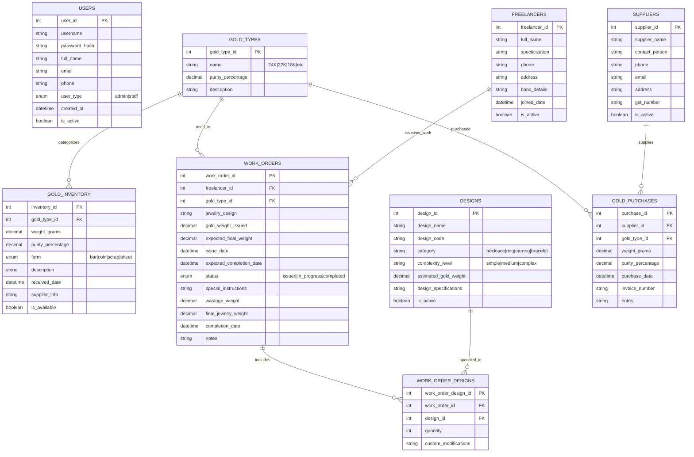

# Gold Jewelry Business Management System - ER Diagram (Simplified)

## Entity Relationship Diagram

## Key Features & Workflows:

### 1. Gold Inventory Management
- Manual entry of gold quantities by type and purity
- Track available vs. allocated gold
- Record gold purchases from suppliers

### 2. Freelancer Work Management
- Issue work orders with specific gold quantities
- Track work progress and completion
- Monitor gold wastage within each order

### 3. Jewelry Production Tracking
- Track gold weight issued vs. final jewelry weight
- Calculate wastage for each work order
- Simple status tracking (issued, in progress, completed)

### 4. Design Management
- Maintain jewelry design catalog
- Track design complexity and estimated gold requirements

### 5. Monthly Reporting
- Gold inventory status
- Work order completion summary
- Freelancer performance metrics
- Wastage analysis

## Simplified Business Rules:
- **Gold-based transactions only** (no currency)
- **Wastage tracked within work orders** (e.g., 100gm issued, 2gm waste, 98gm final)
- **No gold returns** (direct inventory updates)
- **Offline operation** with local SQLite database
- **Monthly reporting** for business insights

This simplified design focuses on your core needs: tracking gold inventory, managing work orders, and monitoring production efficiency.
